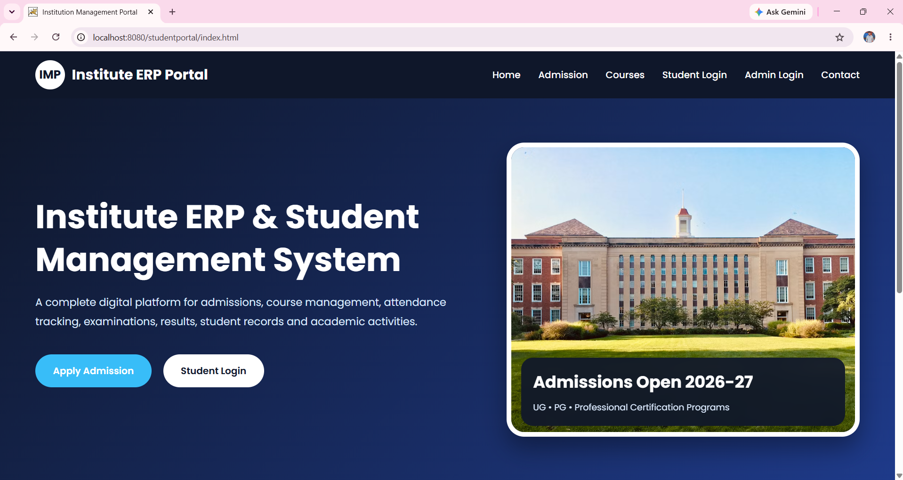
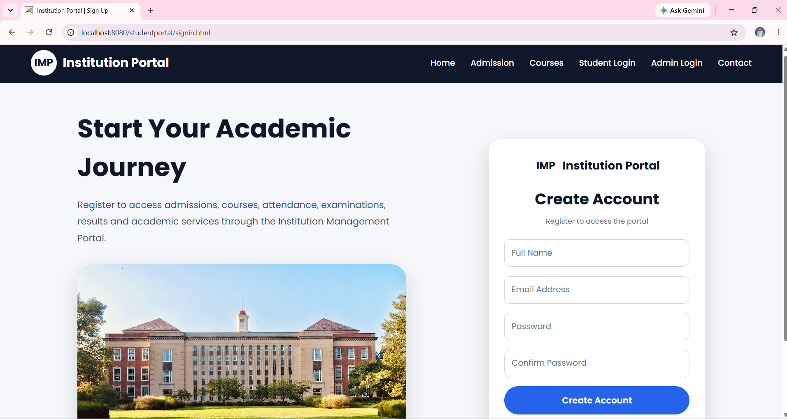
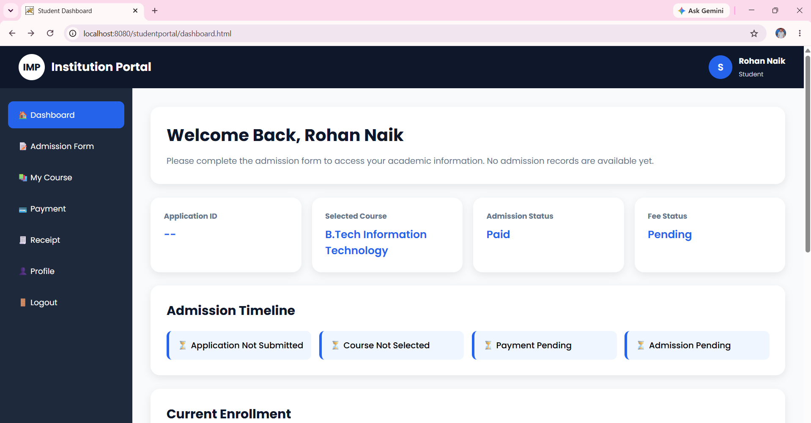
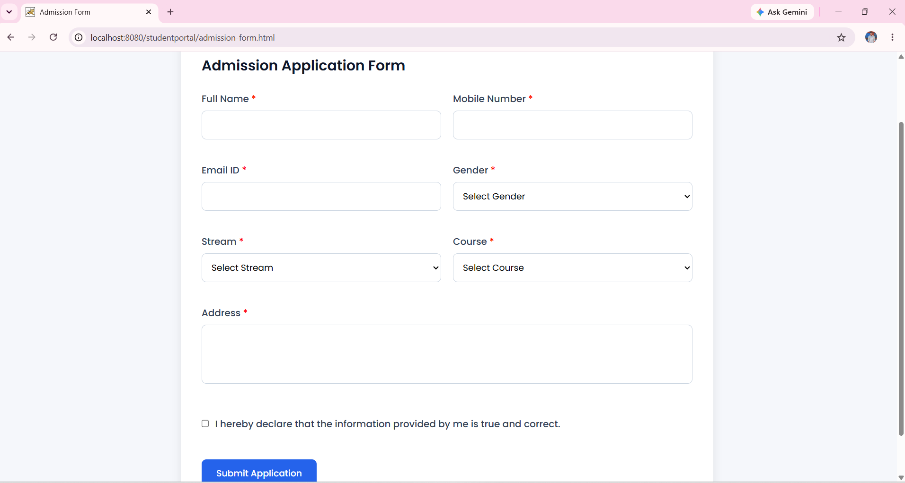
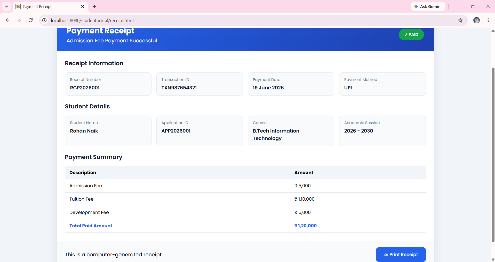
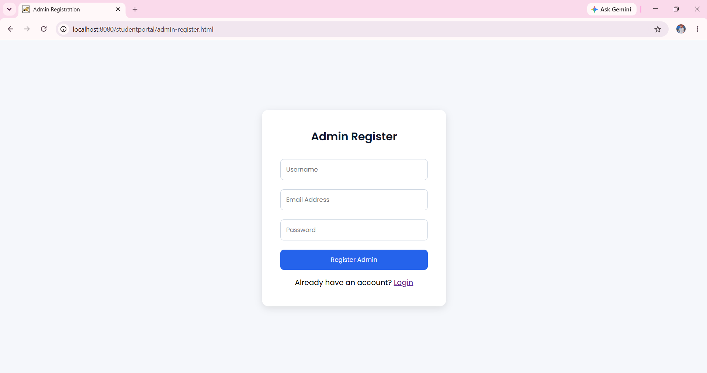
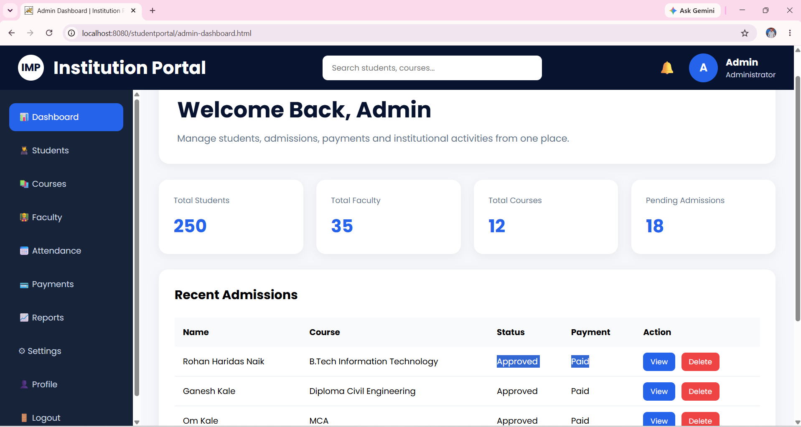
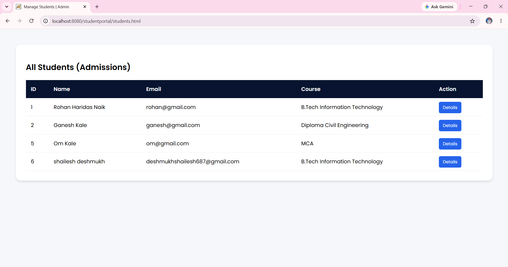
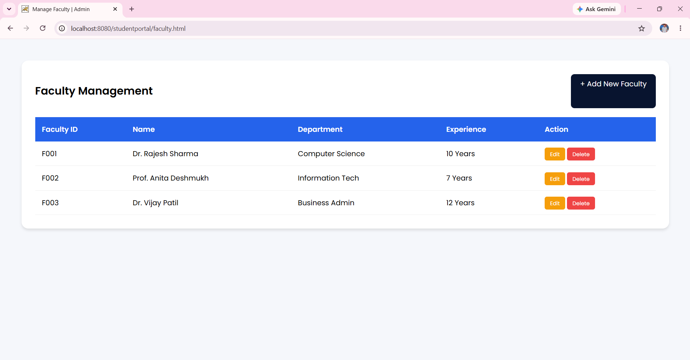
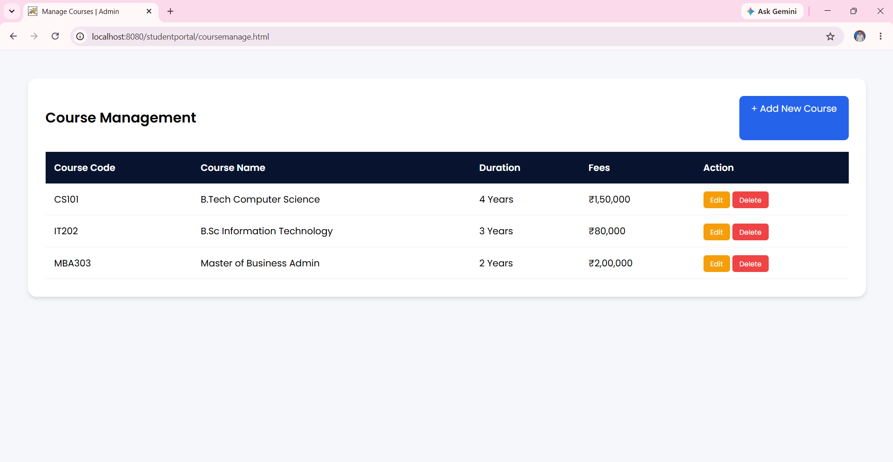

# Institution Management Portal 🎓
> A full-stack web application designed to automate institutional administration, including admissions, course management, and fee processing.

---

## 📑 Table of Contents
* [Overview](#-overview)
* [Key Features](#-key-features)
* [System Architecture](#-how-it-works)
* [Project Preview](#-project-preview)
* [Getting Started](#-how-to-run-it-locally)

---

## 🚀 Overview
Managing institutional records manually is time-consuming and prone to errors. This portal simplifies the entire student lifecycle. It offers a secure platform for student admissions, course tracking, and fee management, providing a unified dashboard for both Admins and Students.

---

## 💡 Key Features
* **👨‍💻 Admin Dashboard:** Real-time metrics for student admissions, faculty records, and course management.
* **🎓 Admission Lifecycle:** End-to-end management of student applications and enrollment.
* **💰 Financial Tracking:** Automated fee processing and receipt generation.
* **📚 Academic Control:** Easy management of faculty details and course curriculum.
* **🔒 Secure Access:** Role-based authentication for both Admins and Students.

---

## 🏗 How it works
* **UI Layer:** HTML/JSP pages providing a responsive and modern interface.
* **Logic Layer:** Java Servlets manage user requests, business logic, and session control.
* **Database Layer:** JDBC connects the application to MySQL, ensuring all academic data is stored securely.

---

## 📸 Project Preview

### **Student Experience**
| Home | Register | Dashboard | Admission Form | Payment Receipt | 
| :---: | :---: | :---: | :---: | :---: |
|  |  |  |  |  |

### **Admin Dashboard & Management**
| Admin Register | Dashboard | Admissions | Faculty Portal | Courses |
| :---: | :---: | :---: | :---: | :---: |
|  |  |  |  |  | 

---

## 🚀 How to Run It Locally
1. **Clone:** `git clone https://github.com/your-username/institution-portal.git`
2. **Database:** Create a database named `institution_db` in MySQL and run the provided SQL schema.
3. **Configure:** Update your DB credentials in the `DBConnection.java` file.
4. **Deploy:** Import the project into your IDE and deploy on Apache Tomcat.
5. **Launch:** Access `http://localhost:8080/studentportal/index.html`

---

## 👨‍💻 Developed By
**Rohan Naik** | [LinkedIn](https://www.linkedin.com/in/rohannaik06) | [Email](mailto:rohannaik1426@gmail.com)
*Built as an academic project for Java Web Technologies.*
